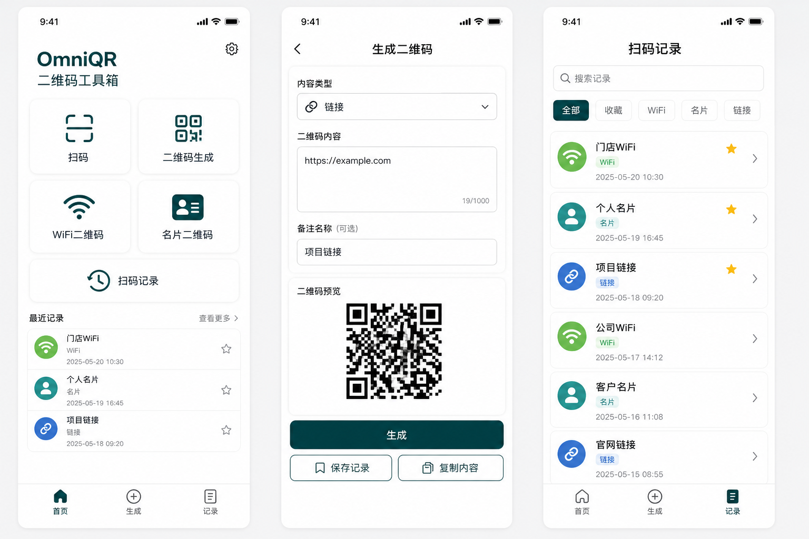

# OmniQR 产品规划

## 1. 产品定位

OmniQR 是一个本地优先的二维码工具箱，重点解决日常二维码生成、WiFi 分享、名片交换和扫码记录管理。产品应保持轻量、快速、低干扰，不依赖账号体系即可完成核心功能。

## 2. 目标用户

- 个人用户：临时生成链接、文本、WiFi 和联系方式二维码。
- 门店和小团队：快速制作门店 WiFi、联系方式、活动链接等常用二维码。
- 运维和办公用户：管理常见二维码内容，减少重复录入。

## 3. MVP 功能范围

### 3.1 二维码生成

支持输入任意文本内容生成二维码。

首版字段：

- 内容类型：文本、链接、自定义内容
- 二维码内容：必填
- 备注名称：选填，用于记录列表展示

首版操作：

- 点击生成后显示二维码预览
- 生成后自动保存到本地记录
- 保存带 OmniQR 风格外框和角落水印的二维码图片到本地相册
- 复制原始内容
- 分享二维码图片

当前实现说明：

- 普通文本/链接二维码采用本地生成，不依赖后端。
- 生成页不会随输入自动生成二维码，必须点击“生成”。
- H5 端相册保存能力按平台降级为图片预览；App 基座优先调用原生相册保存。
- 生成页点击“生成”后会自动保存记录，并读取设置页的默认标题和保存失败预览偏好。

### 3.2 WiFi 二维码

使用标准 WiFi 二维码格式生成可扫码连接的二维码。

首版字段：

- WiFi 名称 SSID：必填
- WiFi 密码：根据加密方式决定是否必填
- 加密方式：WPA/WPA2、WEP、无密码
- 是否隐藏网络：默认否
- 备注名称：选填

格式约定：

```text
WIFI:T:WPA;S:网络名称;P:网络密码;H:false;;
```

当前实现说明：

- WiFi 页面已接入真实二维码生成、自动保存记录、预览、复制和保存二维码图片。
- SSID 和密码会按 WiFi 二维码格式转义分号、逗号、冒号和反斜杠。
- “无密码”模式会禁用密码输入并生成 `nopass` 类型。

### 3.3 名片二维码

使用 vCard 格式生成联系人二维码。

首版字段：

- 姓名：必填
- 手机号：选填
- 公司：选填
- 职位：选填
- 邮箱：选填
- 网址：选填
- 地址：选填
- 备注：选填

格式约定：

```text
BEGIN:VCARD
VERSION:3.0
FN:姓名
ORG:公司
TITLE:职位
TEL:手机号
EMAIL:邮箱
URL:网址
ADR:地址
NOTE:备注
END:VCARD
```

当前实现说明：

- 名片页面已接入真实 vCard 二维码生成、自动保存记录、预览、复制和保存二维码图片。
- 支持姓名、手机、公司、职位、邮箱、网址、地址、备注和记录备注名称。
- 空字段不会写入 vCard，姓名仍为必填。

### 3.4 扫码记录

记录用户生成、扫描和收藏的二维码内容。

首版列表字段：

- 标题
- 类型：文本、链接、WiFi、名片、扫码结果
- 内容摘要
- 创建时间
- 是否收藏

首版操作：

- 查看详情：进入统一记录详情页，显示二维码、原始内容、来源和创建时间
- 复制内容
- 重新生成二维码
- 收藏/取消收藏
- 删除单条记录
- 清空非收藏记录

## 4. 页面规划

当前界面设计参考图：



当前应用素材：

- App 图标：`OmniQR-Uniapp/static/brand/omniqr-app-icon.png`
- 功能图标：`OmniQR-Uniapp/static/icons/*.webp`
- 启动图：
  - `OmniQR-Uniapp/static/splash/splash-480x762.png`
  - `OmniQR-Uniapp/static/splash/splash-720x1242.png`
  - `OmniQR-Uniapp/static/splash/splash-1080x1882.png`

### 4.1 首页

首页作为工具箱入口，优先呈现常用功能。

- 顶部：应用名 OmniQR 和扫描入口
- 功能区：二维码生成、WiFi 二维码、名片二维码、扫码记录
- 最近记录：展示最近 3-5 条记录
- 快捷操作：复制剪贴板内容生成、从相册识别二维码、打开收藏夹

### 4.2 生成页

根据不同类型展示不同表单。用户点击“生成”后进入二维码预览状态。

- 表单输入区
- 二维码预览区：未生成时为空状态，生成后显示真实二维码
- 操作按钮：生成、保存二维码图片、复制内容
- 基础导出样式：深青品牌外框、角落 OmniQR 水印
- 后续样式设置：颜色、背景、边距、尺寸、Logo 嵌入

### 4.3 扫码页

调用系统相机扫码，识别后进入结果页。

- 扫码识别
- 识别结果展示：保存为本地记录并进入记录详情页
- 链接安全提示
- 自动保存到记录
- 从相册选择图片识别二维码
- 手电筒开关
- 连续扫码模式

### 4.4 记录页

集中管理历史记录。

- 类型筛选
- 搜索
- 收藏优先
- 批量清理
- 导入导出
- 标签管理
- 最近使用排序

### 4.5 设置页

集中管理应用偏好、数据备份、隐私政策和免责声明。

- 默认二维码样式
- 默认记录标题
- 语言切换
- 数据导入导出
- 清理缓存
- 隐私政策
- 免责声明

当前实现说明：

- 设置页已接入默认记录标题、保存失败预览图片和二维码尺寸偏好。
- 设置页已接入语言选项，支持简体中文、繁體中文、English、Español、Français、Deutsch、日本語、한국어、Português、Русский、العربية、हिन्दी 等主流语言。
- 支持将设置与记录导出为 JSON 到剪贴板。
- 支持清空非收藏记录、清空全部记录和恢复默认设置。
- 已新增独立隐私政策页面，覆盖本地生成、敏感信息、权限、数据清理和免责声明。

### 4.6 隐私政策页

隐私政策页用于说明二维码生成过程中的数据边界和责任限制。

- 本地生成原则
- WiFi、名片、普通二维码可能包含的信息
- 本地记录和设置存储
- 二维码图片保存、分享和传播边界
- 相机、相册权限说明
- 数据管理方式
- 免责声明和责任限制

### 4.7 记录详情页

记录详情页用于承接历史记录、扫码结果和重新生成入口。

- 顶部：标题、类型、创建时间
- 中部：真实二维码预览
- 内容区：完整原始内容和来源
- 操作区：重新生成、复制内容、收藏/取消收藏、删除记录

## 5. 数据设计

首版优先使用本地存储，不强制接入后端。

```ts
type QrRecord = {
  id: string
  title: string
  type: 'WiFi' | '名片' | '链接' | '文本' | '扫码'
  content: string
  desc: string
  favorite: boolean
  source: 'generated' | 'scanned' | 'imported'
  createdAt: number
  updatedAt: number
}
```

存储建议：

- MVP：`uni.setStorageSync` / `uni.getStorageSync`
- 记录较多后：封装本地存储仓库，统一处理分页、迁移和去重
- 后续增强：支持导入导出 JSON 备份

## 6. 后续功能池

详见 [ROADMAP.md](./ROADMAP.md)。该文档负责维护版本阶段、增强功能和暂缓功能，避免 MVP 需求被过度扩张。

## 7. 技术路线

### 阶段一：可用工具箱

- 已替换默认首页为 OmniQR 工具箱首页
- 已实现文本/链接二维码本地生成
- 已实现本地记录保存、列表展示和详情页
- 已补齐复制内容、删除记录、收藏切换
- 已实现二维码图片导出链路，App 基座待真机验证相册保存

### 阶段二：完整二维码工作流

- 已完善 WiFi / 名片二维码真实生成、自动保存记录、预览、复制和图片导出
- 已实现扫码入口和扫码结果保存详情页，App 真机扫码已验证，当前未发现明显问题
- 已增加收藏、搜索、筛选
- 已增加设置页基础偏好；二维码尺寸、8 款风格、每款 10 款造型、定位角独立造型和固定自定义颜色已接入预览与导出，纠错等级留作后续美化阶段
- 已新增隐私政策和免责声明页面
- 已新增轻量 i18n 国际化，覆盖主流程页面、设置、隐私政策、按钮和提示文案
- 已增加扫码链接安全确认、从相册识别入口、Android 发布检查清单和首版权限收敛

### 阶段三：体验和发布

- 适配 Android App 权限和相册保存
- 适配 H5 预览能力
- JSON 导入去重和导出下载已完成，后续继续补标签、最近使用排序和数据迁移版本
- 完成应用图标、启动图和打包配置
- 建立测试清单和发布说明

## 8. 验收口径

MVP 完成时至少满足：

- 用户可以生成普通文本/链接二维码。
- 用户可以生成 WiFi 二维码，并用另一台设备扫码识别 WiFi 信息。
- 用户可以录入名片信息并生成 vCard 二维码。
- 用户可以保存生成记录，并在记录页重新打开。
- 用户生成二维码后记录会自动保存，不需要额外点击保存记录。
- 用户可以删除记录，收藏记录不会被误清空。
- 用户点击生成后才显示二维码，输入内容不会自动生成。
- 用户可以导出带 OmniQR 品牌外框和角落水印的二维码图片。
- Android 真机上相机扫码、相册保存、复制内容三类能力经过验证。

## 9. 待确认问题

- 首版是否必须支持离线使用：建议必须支持。
- 是否需要用户账号和云同步：建议首版不做。
- 是否需要批量生成二维码：建议作为后续增强。
- 是否需要二维码美化模板：建议在核心链路稳定后再做。
- 首个发布目标是 Android App、H5，还是微信小程序：建议先 Android App + H5。
